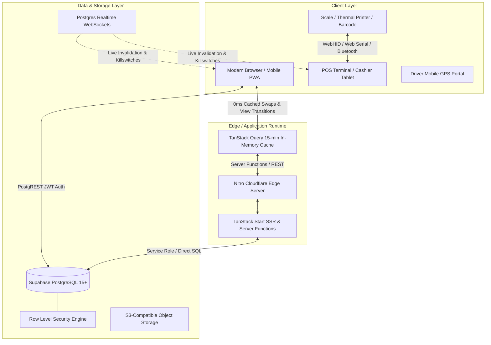
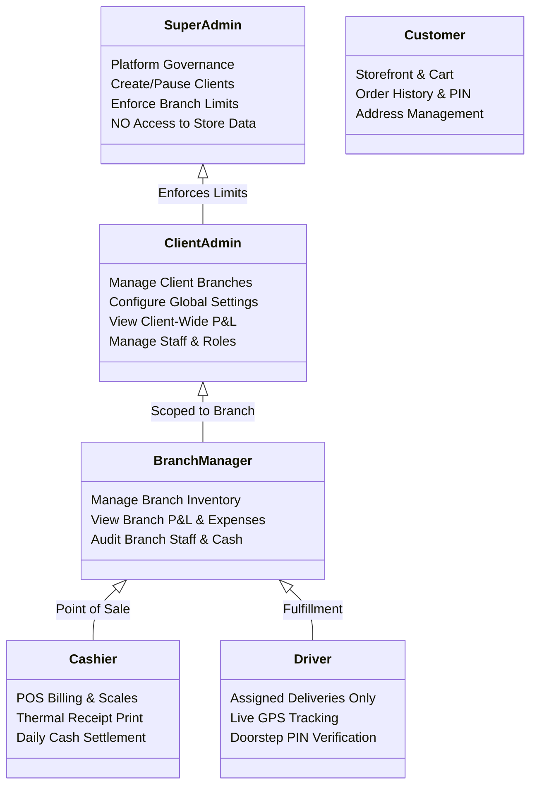

# Universal Retail & Fresh Hub — Enterprise System Architecture

## 1. Executive Summary & System Overview

**Universal Retail Hub** (originated as *Fish N Fresh Hub*) is a high-performance, omnichannel enterprise commerce platform built for multi-tenant, multi-branch retail, grocery, seafood, apparel, and hardware operations. It unifies high-speed desktop/tablet Point of Sale (POS), real-time hardware peripheral drivers (commercial weighing scales, ESC/POS thermal printers, barcode scanners), customer e-commerce storefront, driver dispatch tracking, and granular financial accounting (Profit & Loss, Cost of Goods Sold, GST tax invoices).

### Core Architectural Pillars
- **0ms Perceived Latency Navigation**: Instant route swapping via TanStack Router in-memory caching, eager hover prefetching, and native browser View Transitions.
- **Strict Multi-Tenant & Multi-Branch Isolation**: PostgreSQL Row Level Security (RLS) guarantees complete cryptographic and operational data separation between different enterprise clients and branch locations with zero data leakage.
- **Direct-to-Hardware Web Peripheral Integration**: Hardware-agnostic WebHID and Web Serial protocol drivers communicating directly with weighing scales and thermal printers without requiring third-party desktop bridging agents.
- **Serverless & Edge Ready**: Powered by TanStack Start with Cloudflare Nitro edge compilation, deploying seamlessly to Cloudflare Workers, Node.js, or containerized Docker clusters.

---

## 2. High-Level System Architecture

---

## 3. Technology Stack

| Layer | Technologies | Key Rationale |
| :--- | :--- | :--- |
| **Frontend Framework** | React 19, TypeScript 5.8 | Modern reactive UI, concurrent rendering, and full type safety. |
| **Routing & Preload** | TanStack Router 1.170 | Type-safe file-based routing, 0ms hover prefetching, native browser View Transitions. |
| **Server Framework** | TanStack Start, Nitro | Unified client/server RPC via `createServerFn`, Cloudflare Workers edge compatibility. |
| **State & Caching** | TanStack Query v5 | Tiered stale-while-revalidate caching, offline-first support, 0ms instant data rendering. |
| **Database & Auth** | Supabase (PostgreSQL 15), Supabase Auth | Enterprise SQL engine, Row Level Security (RLS), JWT authentication, realtime change CDC. |
| **Styling & UI** | Tailwind CSS v4, Radix UI Primitives, Lucide Icons | Zero-runtime CSS, fully accessible headless components, dark/light theme engine. |
| **Hardware Drivers** | Web Serial API, WebHID API, Canvas ESC/POS | Native browser-to-hardware communication without proprietary drivers or desktop agents. |
| **Testing & Quality** | Vitest, TypeScript compiler (`tsc --noEmit`) | Sub-second isolated unit testing (134/134 passing tests) and strict compile-time verification. |

---

## 4. Multi-Tenant & Multi-Branch Partitioning

### 4.1 Role Hierarchy & Permission Boundaries

### 4.2 Row-Level Security (RLS) Isolation Principles
1. **Branch Isolation**: Every operational record (`orders`, `expenses`, `purchases`, `waste_logs`, `cash_settlements`, `products`) contains a nullable or mandatory `branch_id`.
2. **Strict Super Admin Partitioning**: Super Administrators are strictly restricted to client governance and branch limit enforcement. Super Admins cannot view or modify internal financial data, customer orders, or inventory of individual stores.
3. **Branch-Scoped Queries**: All queries accept an active `branch_id` parameter or default to the user's assigned branch. Branch switchers dynamically scope TanStack Query cache keys (e.g., `["admin", "orders", activeBranchId]`).

---

## 5. Hardware Driver Subsystem

### 5.1 Weighing Scale Protocol Engine (`src/lib/weighingScale.ts`)
The weighing scale subsystem connects directly to digital trade scales via Web Serial (`navigator.serial`) and WebHID (`navigator.hid`).
- **Supported Scale Protocols**: CAS (PB/AP/SW series), Essae Teraoka (DS series), Mettler Toledo, Avery Berkel, Phoenix, Citizen, and Universal ASCII stream protocols.
- **Continuous Auto-Stabilization Engine**:
  - Analyzes continuous ASCII telemetry packets (`ST,GS,+001.450kg`).
  - Detects weight stability over a configurable window (default 3 consecutive identical samples).
  - Automatically dispatches `weight_stable` events to the POS counter for hands-free, high-throughput checkout.
  - Re-arms auto-capture only after the scale platter is cleared (< 10g), preventing double billing.

### 5.2 ESC/POS Thermal Printing Pipeline (`src/lib/thermalPrinter.ts`)
The printing pipeline formats and outputs 58mm (2-inch) and 80mm (3-inch) thermal receipts:
- **Output Channels**: Network TCP Socket (`ESC/POS Raw Port 9100`), Web Bluetooth, Web Serial, and Native Browser Print / Canvas rasterization.
- **Capabilities**:
  - Dynamic QR code generation for UPI instant scan & pay at counter.
  - Multilingual text rendering (including Tamil unicode) via off-screen HTML5 Canvas bitmap slicing.
  - Automatic paper cut (`GS V 66 0`) and cash drawer kick (`ESC p 0 25 250`).
  - Standardized GST compliant tax receipts with HSN codes, tax rate slabs, and store details.

---

## 6. Financial & Inventory Engine

### 6.1 Cost of Goods Sold (COGS) & P&L Calculation (`src/lib/pnl.ts`)
The financial calculation engine aggregates gross revenue, direct costs, operational expenses, and spoilage:

$$\text{Net Revenue} = \text{Gross Sales} - \text{Discounts} - \text{Refunds}$$

$$\text{Total Direct Cost} = \text{Purchases / COGS} + \text{Waste / Spoilage Loss}$$

$$\text{Gross Profit} = \text{Net Revenue} - \text{Total Direct Cost}$$

$$\text{Net Profit} = \text{Gross Profit} - \text{Operating Expenses}$$

- **Real-Time Batch Tracking**: Purchases link to batches (`inventory_batches`) tracking purchase rate, quantity received, supplier info, and expiration dates.
- **Waste Management**: Spoilage, transit damage, and trimming waste are recorded in `waste_logs` and debited directly from branch gross profit.
- **Isolated Branch Reports**: All metrics can be aggregated platform-wide or filtered to a single branch with zero leakage.

### 6.2 Three-Tier GST Tax Engine (`src/lib/exportUtils.tsx` & `src/lib/pnl.ts`)
- Configurable GST rates (0%, 5%, 12%, 18%).
- Automatic splitting into CGST (Central) and SGST (State) for intra-state transactions, or IGST (Integrated) for inter-state orders.
- B2B tax invoice generation with customer GSTIN validation and downloadable thermal / PDF receipts.

---

## 7. Performance & 0ms Navigation Architecture

To deliver an instantaneous desktop application feel on the web:
1. **0ms Route Transitions**:
   - `_authenticated/route.tsx` uses synchronous local storage session inspection (`supabase.auth.getSession()`) with an in-memory TTL user cache, eliminating the 200ms–800ms remote network roundtrip on every page navigation.
2. **Layout Persistence**:
   - `AdminShell.tsx` preserves mounted sidebar, header, and layout chrome across route changes. Role queries have a 15-minute `staleTime`, eliminating loading spinners and layout teardown flickers.
3. **Eager Hover/Touch Prefetching**:
   - Router configured with `defaultPreload: "intent"` and `defaultPreloadDelay: 0`.
   - Hovering or touching any navigation link immediately triggers chunk fetching and data preloading.
4. **Native Browser View Transitions**:
   - TanStack Router's `defaultViewTransition: true` coordinates smooth, hardware-accelerated cross-fades between page DOM states.

---

## 8. Real-time WebSockets & Security Subsystem

### 8.1 PostgreSQL Realtime Change Data Capture (CDC)
- Centralized in `src/routes/__root.tsx` via `RealtimeSubscriber`.
- Listens on `public:products` and `public:store_settings` to invalidate TanStack Query caches across all connected devices in real time when an admin updates pricing, stock, or banner settings.

### 8.2 Security Session Revocation & Emergency Killswitch
- **Platform Revocation Channel** (`platform_revocations` table): Admins can revoke active user sessions across 3 scopes:
  1. `global`: Emergency platform-wide logout.
  2. `user`: Immediate termination of a specific compromised account.
  3. `branch`: Immediate termination of all staff terminals at a specific location.
- **Ephemeral Broadcast Killswitch** (`security_killswitch` channel): Instantly triggers `supabase.auth.signOut()`, purges sensitive tokens from `localStorage`, and displays security notifications.
